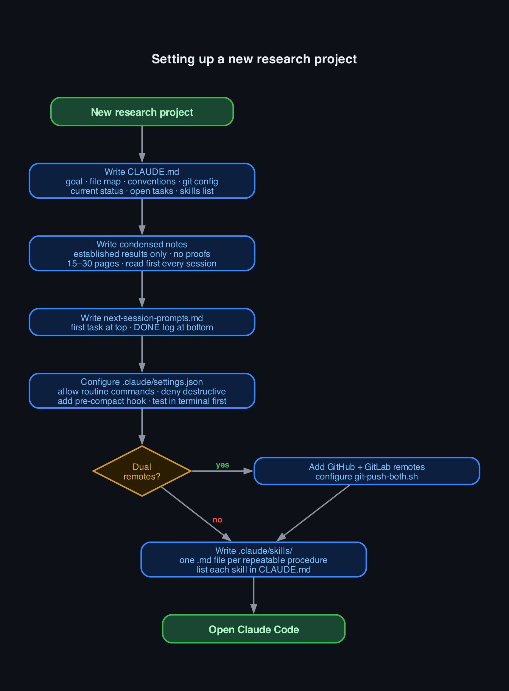
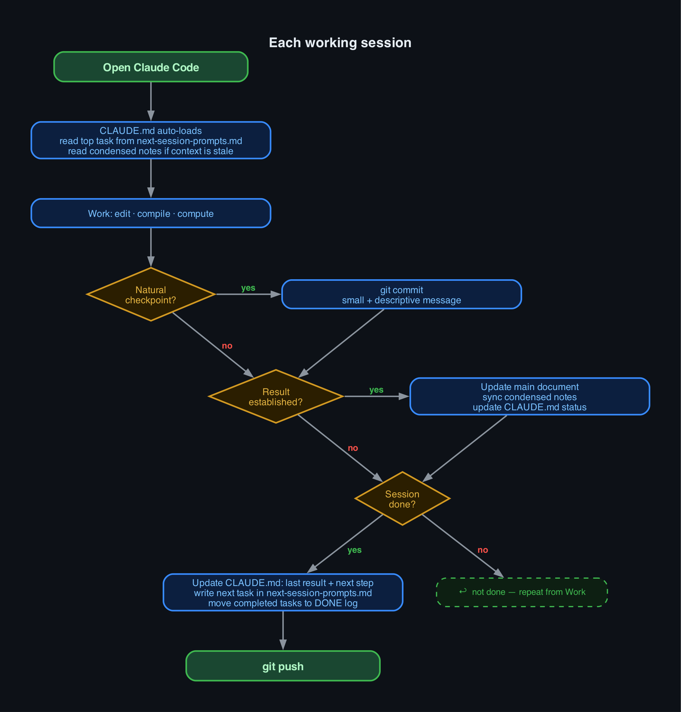

# Claude for Researchers

A practical guide and toolkit for researchers — especially physicists and mathematicians
— who want to use [Claude Code](https://claude.ai/code) productively on long, technically
demanding projects.

This guide is written from real experience running a months-long mathematical research
project with Claude Code, not a weekend experiment. It covers what works, what wastes time,
the failure modes you will hit, and how to set up a workflow that survives them.

---

## Table of Contents

0. [Installation and first launch](#installation-and-first-launch)
1. [Quick-start flowcharts](#quick-start-flowcharts)
2. [The right mental model](#the-right-mental-model)
3. [CLAUDE.md: the most important file](#claudemd-the-most-important-file)
4. [Skills: reusable procedures](#skills-reusable-procedures)
5. [The dual-document pattern: main.tex and condensed.tex](#the-dual-document-pattern-maintex-and-condensedtex)
6. [Session continuity: next-session-prompts.md](#session-continuity-next-session-promptsmd)
7. [Settings and hooks](#settings-and-hooks)
8. [Git workflow for academics](#git-workflow-for-academics)
9. [GitHub README and LaTeX](#github-readme-and-latex)
10. [Numerics and computation](#numerics-and-computation)
11. [Honest limitations](#honest-limitations)
12. [Templates and scripts in this repo](#templates-and-scripts-in-this-repo)

---

## Installation and first launch

This section is for readers who have never used VS Code or Claude Code before.
If you are already set up, skip to [Quick-start flowcharts](#quick-start-flowcharts).

### What you need

- A computer running macOS, Windows, or Linux
- An [Anthropic account](https://console.anthropic.com/) (the same account you use for Claude on the web)
- A Claude Pro subscription **or** API credits — Claude Code uses your API account

You do not need to know anything about terminal commands or configuration files
to get started. This guide walks through each step.

---

### Step 1 — Install VS Code

VS Code is a free text editor made by Microsoft. Claude Code runs inside it as
an extension. You can also run Claude Code in a standalone terminal, but VS Code
gives you a much better experience: you see the files Claude is editing, the
terminal where it runs, and the chat window all in one place.

1. Go to [https://code.visualstudio.com](https://code.visualstudio.com) and
   click the download button for your operating system.
2. Run the installer. On macOS, drag VS Code into your Applications folder.
   On Windows, the installer does everything for you.
3. Open VS Code. You will see a welcome screen. You can close it.

That is all. You do not need to configure anything in VS Code before continuing.

---

### Step 2 — Install the Claude Code extension

1. In VS Code, click the **Extensions** icon on the left sidebar (it looks like
   four squares, one slightly detached).
2. In the search box that appears, type `Claude Code`.
3. The first result should be "Claude Code" by Anthropic. Click **Install**.
4. After installation, a Claude icon appears in the left sidebar.

Alternatively, you can install Claude Code as a command-line tool and use it
from any terminal without VS Code:

```bash
npm install -g @anthropic-ai/claude-code
```

This requires Node.js to be installed. The VS Code extension is easier if you
are not familiar with the terminal.

---

### Step 3 — Sign in

1. Click the Claude icon in the VS Code sidebar.
2. Click **Sign in with Anthropic**.
3. A browser window will open. Sign in with your Anthropic account.
4. After signing in, return to VS Code. You should see a chat interface.

If you are using API credits instead of Claude Pro: in the sign-in screen,
choose **Use API key**, paste your key from
[console.anthropic.com/settings/api-keys](https://console.anthropic.com/settings/api-keys),
and confirm.

---

### Step 4 — Open your project folder

Claude Code works on a folder, not a single file. It reads the files in your
project folder and makes changes to them.

1. In VS Code, go to **File → Open Folder** (macOS: **File → Open...**).
2. Navigate to your research project directory and open it.
3. VS Code will show your files in the left sidebar under "Explorer."

If you do not have a project folder yet, create one:

```bash
mkdir my-research-project
cd my-research-project
git init
```

The `git init` command sets up version control, which Claude Code uses to track
changes and help you undo mistakes. If you do not have git installed, see
[git-scm.com/downloads](https://git-scm.com/downloads).

---

### Step 5 — Start a conversation

In the Claude Code chat panel (the one that opened when you clicked the Claude
icon), type a message and press Enter. For example:

> "I just opened my project folder. What files are in it?"

Claude will look at your folder and reply. From here, you can ask it to read
files, write code, compile LaTeX, run Python scripts, or help you organise your
work.

**The most important thing to do next** is create a `CLAUDE.md` file in your
project folder. This file tells Claude everything it needs to know about your
project every time you open it. Without it, Claude starts each session knowing
nothing about your work. The [CLAUDE.md section](#claudemd-the-most-important-file)
below explains exactly what to put in it.

---

### A note on cost

Claude Code charges per message based on the length of the conversation. A
typical research session (a few hours of active use) costs roughly $1–5 USD in
API tokens, depending on how much context is loaded and how many files are read.

You can track your usage at
[console.anthropic.com/usage](https://console.anthropic.com/usage). If you have
a Claude Pro subscription, Claude Code usage is included in that plan.

---

## Quick-start flowcharts

Animated overviews of the two key workflows. Each step appears in sequence so
you can follow the logic before reading the full guide.

| Setting up a new project | Each working session |
|:---:|:---:|
|  |  |

Green = start/end · Blue = action · Gold = decision · Red label = no path · Green label = yes path

---

## The right mental model

Before setting anything up, it helps to understand what kind of tool Claude Code
actually is, because the wrong mental model leads to the wrong workflow.

**Claude Code is not a research collaborator.** It does not have intuition, taste,
or genuine understanding of your field. It has read an enormous amount of text,
including mathematical papers, and can pattern-match on that reading very
effectively. That is genuinely useful, but it is different from understanding.

**Claude Code is not an intelligent assistant that figures things out.** It follows
instructions. If your instructions are vague, the result will be vague. If your
instructions are precise — which file, which section, which formula, what to check —
the result will be precise and fast.

**Claude Code is a very capable junior research assistant.** It can:
- Write, edit, and compile LaTeX faster than you can, including tracking down obscure errors
- Write Python or Mathematica computation scripts from a clear specification
- Keep careful records — updating documents, maintaining logs, tracking what was tried
- Read and navigate a large document without losing track of the structure
- Do tedious mechanical work (checking all cases of a formula, renaming things consistently)
  without making the transcription errors a human would make

What it cannot do:
- Notice when a mathematical argument is wrong on its own terms (it may reproduce
  the error confidently)
- Supply physical intuition or mathematical taste
- Know when it is out of its depth (it will not tell you unprompted)
- Remember anything reliably between sessions without explicit help

The workflow described in this guide is designed to make the "capable junior assistant"
model actually work in practice: it keeps Claude well-informed about your project,
tells it precisely what to do, and keeps you in control of all decisions that matter.

---

## CLAUDE.md: the most important file

### What it is

`CLAUDE.md` is a plain text file that lives at the root of your project directory.
Claude Code reads it automatically at the start of every session, before you type
anything. It is the primary way you communicate standing instructions, context,
and conventions to Claude.

Every session, Claude starts with no memory of previous sessions. Without CLAUDE.md,
you spend the first 20 minutes of every session re-explaining your project. With a
good CLAUDE.md, Claude starts the session already knowing:

- What the project is and what you are trying to achieve
- The notation and conventions you use
- Where everything is and which file is authoritative
- What has been established and what is still open
- Exactly what to do next
- How you want it to behave (chat style, writing style, what tools to use)

A good CLAUDE.md is the difference between a session that is productive from the
first message and one that wastes half an hour on orientation.

### Why it is the most important file

Every other practice in this guide — the condensed notes, the session log, the
skills — feeds into the session through CLAUDE.md. If CLAUDE.md is wrong, incomplete,
or out of date, every session will be off. No amount of clever tooling fixes a bad
CLAUDE.md.

Conversely, a well-maintained CLAUDE.md is so effective that experienced Claude Code
users often say it is the one practice that most clearly separates productive from
unproductive research workflows.

### What to put in it

A CLAUDE.md for a research project should contain the following sections.

---

#### 1. Project goal

One or two paragraphs. What is this project? What is the mathematical or scientific
object you are studying? What is the open question you are working toward?

Be precise. Not "I am studying Eisenstein series" but "I am computing the regularised
integral of a product of four Eisenstein series over the modular fundamental domain
as a function of their spectral parameters, using the Rankin–Selberg method." The
more specific you are, the more accurately Claude understands the scope of the project
and can judge whether something is relevant.

---

#### 2. File map

A list of every file or directory Claude needs to know about, with one sentence each
explaining what it is and what it is for. Explicitly say which file is authoritative.

Example:
```
- condensed.tex — 20-page self-contained reference; READ FIRST in every new session.
  Contains all current results, key formulas, and open problems. No proofs.
- main.tex — the full paper draft (~250 pages). Authoritative record; everything
  established is here in full detail. Too large to read in full — grep or use section labels.
- next-session-prompts.md — task log. Top = next task; bottom = DONE log.
- numerics/ — computation scripts. numerics/README.md explains each file.
```

---

#### 3. Conventions

The exact notation and conventions Claude must get right. This is critical for
mathematical and physics projects, where a sign error or wrong normalisation
is not a style issue but a factual error.

Include:
- Definitions of every symbol that appears in your calculations
- Which normalisation convention you use (there are often several in the literature)
- Sign conventions
- Which branch of a function you take
- Any non-standard notation

Example:
```
- ξ(s) = π^{-s/2} Γ(s/2) ζ(s). Functional equation: ξ(s) = ξ(1-s).
  Simple poles at s=0 (residue -1/2) and s=1 (residue +1/2).
- E*_s = ξ(2s) E(z,s) is the completed Eisenstein series. NOT the same as E(z,s).
  Simple poles at s=0,1 with residues ∓1/2.
- M_3(μ_0,μ_1,μ_2,μ_3) = the depth-three Mellin transform. The variable s = μ_0
  is the Mellin variable; μ_1,μ_2,μ_3 are the spectral parameters of the three
  Eisenstein factors.
- ∏ξ always means ∏_{i=0}^3 ξ(2μ_i).
```

Do not assume Claude knows what your symbols mean "from context." Write the conventions
explicitly every time.

---

#### 4. Current status

A short, honest summary of where the project is right now. Not history — current state.
One screenful. This is the section you update most often.

It should answer:
- What has been established (what is rigorous and complete)?
- What is the most recent result?
- What is the exact next step?

Example structure:
```
## Current status

**Last result (2026-06-04):** The discrete Maass block D was observed directly
at (μ_0,μ_1,μ_2,μ_3) = (12,2,2,2). Residual R = M_3 − 2(½∏ξ·ΣΞ + ½∏ξ·C_cont)
= 2.64e-9 agrees with ∏ξ·D to 0.014% with no free parameters (L-values from LMFDB).

**Established:**
- All 8 boundary residues Res_{μ_i=1} = +½Z, Res_{μ_i=0} = -½Z (theorem)
- All 16 interior pole hyperplanes identified (pinch analysis)
- Interior residue formula R_σ = -∏ξ(2μ_i - [σ_i=-1]) (numerically validated at 3 tuples)
- M_3 is NOT a Langlands-Shahidi ratio (E ≠ 0 confirmed)

**Open:**
- Deep DK-derivation sections need the κ=1 factor-2 audit (~90 instances)

**Next step:** See next-session-prompts.md Prompt A.
```

---

#### 5. Chat formatting

Tell Claude explicitly how you want math written in chat. This matters because
Claude Code's chat interface does not render LaTeX. If Claude writes
`$\xi(s) = \pi^{-s/2}\Gamma(s/2)\zeta(s)$` in a chat reply, you see raw LaTeX,
not a formula.

The standard instruction:
```
## Chat formatting (NON-NEGOTIABLE)
In chat replies, do NOT use LaTeX markup ($...$, \frac{}{}, \xi, \Gamma, etc.).
Write math in plain Unicode: ξ, μ, Γ, ζ, ∑, ∏, ∫, √, ½, →, ≈, ≤, ⇒,
subscripts as M_3 / μ_0 / s_i, superscripts as e^{-π t}, τ^{-2}.
LaTeX belongs ONLY inside .tex files.
```

Mark this as NON-NEGOTIABLE. Without this instruction, Claude will revert to LaTeX
in chat after a few exchanges.

---

#### 6. Open tasks

The current ranked list of things to do. This section is what Claude looks at to
decide what to work on next when you say "continue" or "pick up where we left off."

Keep it short — two or three items. The full task log lives in `next-session-prompts.md`.
This section is just the top of the queue.

---

#### 7. Skills

List every skill you have defined and what it does. See the [Skills section](#skills-reusable-procedures)
below for what skills are. A one-line description per skill is enough here.

Example:
```
## Skills
- /latex-compile — compile main.tex or condensed.tex, fix errors and overfull boxes.
- /sync-condensed — propagate new results from main.tex to condensed.tex.
- /verify-residue — check a specific residue computation against the formula.
```

---

#### 8. Writing style for your main document

If Claude is helping you write or edit your main document, tell it explicitly what
level of detail you expect. Researchers have very different preferences, and Claude's
default is far too terse for most mathematical writing.

Example (verbose style):
```
## Writing style in main.tex (NON-NEGOTIABLE)
main.tex is the authoritative, comprehensive record. Show every step of every
calculation. State each substitution, each application of the functional equation,
each sign and factor-of-two choice — explicitly, in its own sentence. Never collapse
a multi-step manipulation into "one finds" or "a short computation gives." If in
doubt, over-explain. A reader must be able to reconstruct every result from main.tex
alone, with no external notes and no gaps.
```

If you prefer concise theorem-proof style instead, say that. The point is to say
something explicit rather than leaving it to Claude's default.

---

#### 9. Numerics configuration

If you run computations, tell Claude the setup:
```
## Numerics
- Primary engine: Python + mpmath (arbitrary precision)
- Precision: mp.dps = 30 unless stated otherwise
- venv: numerics/venv/ — run as numerics/venv/bin/python numerics/script.py
- Route long-running output to: numerics/run.log
- Mathematica (wolframscript): for symbolic verification only, not primary
```

---

#### 10. Git configuration

Tell Claude your exact remote setup:
```
## Git
- Remote 'github': https://github.com/YOUR_USER/YOUR_REPO.git (primary, main tracks it)
- Remote 'gitlab': git@git.YOUR_INSTITUTION.ac.uk:YOUR_ID/YOUR_REPO.git (institution mirror)
- Push: git push github main (hook auto-mirrors to gitlab)
- Commit author: YOUR_NAME <your-email>
- No Co-Authored-By trailers in commits.
```

Without this, Claude will push to the wrong remote or use the wrong identity.

---

### What NOT to put in CLAUDE.md

**Not a logbook.** CLAUDE.md is a current-state snapshot, not a history. When a
task is done, move it to the DONE log in `next-session-prompts.md`. When a status
changes, update the section in place — do not append a new dated block. Appended
blocks accumulate, CLAUDE.md grows, Claude reads old states as if they were current,
and sessions degrade.

**Not a full exposition.** CLAUDE.md should be navigable in one or two screenfuls
per section. Detailed content belongs in your condensed notes document (see below).
CLAUDE.md points Claude to the condensed notes; it does not replace them.

**Not speculative or in-progress work.** Only write what is established. In-progress
calculations belong in `next-session-prompts.md`. A CLAUDE.md that says something is
established when it is not will cause Claude to treat it as proven and build on it.

---

### How to maintain CLAUDE.md

The most important habit: **update the "Current status" and "Open tasks" sections
before ending every session.** This takes five minutes and saves thirty minutes of
re-orientation next session.

Before closing Claude Code:
- Change "last result" to what you just found
- Move completed items out of "Open tasks" to the DONE log in `next-session-prompts.md`
- Write the next open task clearly

If you forget to do this, the next session starts from the wrong state. If this
happens repeatedly, sessions become progressively less useful.

The pre-compact hook (see [Settings and hooks](#settings-and-hooks)) automatically
stamps CLAUDE.md with a timestamp when the context window fills up, so you can
see exactly when a compaction happened and use `next-session-prompts.md` to re-orient.

---

### Common CLAUDE.md mistakes

**Too long.** If CLAUDE.md is more than 5–6 screenfuls, Claude spends too much
context on it. Move detailed exposition to the condensed notes document. Keep CLAUDE.md
as a navigation index and current-status snapshot.

**Not updated.** A CLAUDE.md that has not been updated for a week is misleading.
Claude will work from the old state as if it were current.

**Wrong status.** Marking something as established when it is only conjectured, or
missing a correction to an earlier result. Claude will confidently build on wrong premises.

**No conventions section.** Without conventions, Claude will guess what your symbols
mean. It will often guess wrong in exactly the way that is hardest to catch — a
plausible-looking sign or normalisation error.

**Instructions given once and forgotten.** Things like "write math in plain Unicode
in chat" or "show every step in main.tex" need to be in CLAUDE.md permanently, not
said once in conversation. Claude does not remember conversation instructions between
sessions.

---

## Skills: reusable procedures

### What skills are

Skills are named, reusable instruction sets for Claude. You define a skill once by
writing a Markdown file in `.claude/skills/`. After that, any time you type
`/skill-name` in your Claude Code session, Claude executes that skill.

Think of skills as macros or procedures: instead of explaining a multi-step process
every time you need it, you write it once and invoke it by name. Claude reads the
skill file and follows the instructions in it.

Skills are different from CLAUDE.md instructions in an important way: CLAUDE.md
is always active (Claude reads it every session). Skills are invoked on demand.
Use CLAUDE.md for standing instructions about how to behave; use skills for
specific procedures you want to run on demand.

### Why skills are useful

Without skills, you find yourself typing the same instructions over and over:
"Compile main.tex, fix any errors, tell me the page count and any overfull boxes."
With a skill, you type `/latex-compile` and Claude does exactly that procedure,
exactly the same way, every time.

For research, the most valuable skills are:

**Compilation skills** — compile your document, catch a specific class of errors,
report in a standard format. Without a skill, you either write these instructions
every time or get inconsistent behavior.

**Sync skills** — propagate changes between related documents (e.g., from your
full paper to your condensed notes). The criteria for what to propagate are subtle;
writing them once in a skill ensures consistent judgment across sessions.

**Verification skills** — run a specific check against current results. For
mathematical projects, this might be "verify that this formula gives the right
residue at a specific point." Writing the check protocol in a skill means Claude
always checks the right things in the right order.

**Writing skills** — draft a new section in your house style (verbose, step-by-step,
with explicit justifications) and append it to the main document. If you always want
sections to have the same structure and level of detail, a skill enforces that.

### How to write a skill

Skills live in `.claude/skills/` in your project directory, one file per skill.
The file is a Markdown document. Claude reads it and follows it when you invoke
the skill.

A skill file has a simple structure:

```markdown
# skill-name

One sentence describing what this skill does.

## When to invoke
Precise conditions: what state should the files be in, what is the input,
what triggers you to run this rather than something else.

## Input
What arguments the user can pass: /skill-name condensed.tex, or /skill-name §3, etc.

## Steps
1. Concrete step.
2. Concrete step, referencing specific tools or commands.
3. Include error handling: what to do if step 2 fails.

## Output format
What Claude tells you when done. A standard format helps you scan results
quickly across many sessions.
```

The key is specificity. Vague skills ("do analysis") produce vague results.
Specific skills ("run pdflatex twice, check for error lines starting with `!`,
fix undefined control sequences by checking the preamble macros, report page count
and overfull box count > 5pt") produce consistent, reliable results.

### When to write a skill vs not

**Write a skill when:**
- You will do this procedure more than twice
- The procedure has a checklist or a defined done-condition
- The procedure involves a judgment (e.g., which changes are "load-bearing") that
  you want to codify consistently
- The order of steps matters and is non-obvious
- You want the result reported in a standard format every time

**Do not write a skill when:**
- You only need to do this once (just give the instruction in chat)
- The procedure genuinely varies each time
- The task is simple enough to state in one sentence

### Example: the latex-compile skill

Here is a complete, working skill from this repository:

```markdown
# latex-compile

Compile a LaTeX document, fix errors and overfull hboxes, and report the result.

## When to invoke
After any edit to a .tex file. Also invoke before committing.

## Input
The user may specify a file: `/latex-compile condensed.tex`. Default: main.tex.

## Steps

1. Run `pdflatex -interaction=nonstopmode -halt-on-error <file>` twice.
   (Second pass resolves cross-references and TOC entries.)

2. Check the output for:
   - Fatal errors (lines starting with `!`):
     - "Undefined control sequence": check macro definitions in preamble.
     - "Missing {": usually a fragile macro in a section title;
       use \DeclareRobustCommand instead of \newcommand.
     - "Missing $": stray character in math mode.
   - Undefined references (LaTeX Warning: Reference ... undefined):
     report to user; do not fix (these are usually expected forward refs).
   - Overfull hboxes > 5pt: fix by adding a line break at a natural word boundary,
     switching inline math to display math, or adding \emergencystretch=3em.

3. Report: page count, number of undefined references, number of overfull hboxes.

## Output format
Compiled <file>: N pages, M undefined refs, K overfull hboxes.
[If errors fixed: fixed X / remaining Y (describe each remaining error)]
```

Short, specific, consistent output.

---

## The dual-document pattern: main.tex and condensed.tex

### The problem

Mathematical and physics research projects involve long documents. A paper draft,
after a few months of work, might be 150 to 300 pages. Claude Code has a finite
context window. When your main document exceeds what fits in context, something
breaks: Claude can no longer read the whole document, and sessions begin to
degrade — Claude forgets earlier results, contradicts itself, misses constraints
that were established weeks ago.

You cannot solve this by making Claude read the document in pieces each session.
That takes too long and the pieces do not form a coherent picture. And you cannot
solve it by making CLAUDE.md longer — a CLAUDE.md that attempts to summarise a
200-page paper is itself too long and misses exactly the details that matter.

### The solution: two documents with different purposes

Maintain two documents in parallel:

**The main document** (`main.tex` or equivalent) is your full, authoritative record.
Everything established goes here in complete detail. Theorems with proofs.
Derivations step by step. Numerical results with methods and validation. Corrections
clearly stated. This document is verbose by design. It is written for a human reader
who wants to understand everything, and it is the record you would submit for
publication. Claude does not read this document in full each session — it is too long.
Instead, Claude navigates it with `grep` and targeted reads when it needs a specific
equation or section.

**The condensed document** (`condensed.tex`, `notes.md`, or whatever name you choose)
is a short (15–30 pages / 1000–3000 lines) self-contained reference. It contains
the current state of the project: what is established, what the key formulas are,
what is open, and where to find things in the main document. It contains no proofs,
no derivations, no history. Claude reads this document at the start of new sessions
as the primary orientation source.

The condensed document acts as a compressed session memory. When the main document
has grown beyond what fits in context, Claude reads the condensed version and stays
accurately oriented.

### What to put in the main document

Everything. The main document is the authoritative record, and "authoritative"
means complete. There are no results too numerical or too routine to include in full.
If a calculation was worth doing, it is worth recording in full detail.

Specifically:
- Every theorem and proposition with a complete proof
- Every formula with the full derivation shown step by step
- Every numerical result: what was computed, the method, the precision, the validation,
  and any caveats
- Every correction: if you found an error and fixed it, the corrected statement and
  an explicit note that the old version was wrong
- Every failed attempt that taught you something, with an explanation of why it failed

The reason for this completeness is practical, not pedantic. A result you "know"
but did not write down will be forgotten when the context rolls over. The main
document is what survives.

### What to put in the condensed document

Only what is established and currently relevant. The condensed document is a snapshot
of the current state of knowledge about the project, compressed to what is essential.

**Include:**
- Every established theorem and proposition, stated precisely (without proof)
- Every key formula, with the exact normalizations and signs you use
- A cross-reference to the main document for each result (section label or equation name)
  so Claude can navigate there when it needs the derivation
- The current status: what is proved, what is conjectured, what is open
- Open problems, ranked by importance
- A concise conventions section
- Recent corrections (the corrected statement, clearly marked as corrected)

**Exclude:**
- Proofs and derivations
- Pedagogical examples and motivation
- History (how you arrived at results, what you tried first)
- In-progress or speculative work
- Anything that is not yet established

### How to structure the condensed document

A structure that works well:

```
§1  Abstract / main results
    The 2–3 key theorems stated precisely. Someone reading only this
    section should know what the project has established.

§2  Conventions and definitions
    Every symbol defined, with the exact normalisation used.
    This section prevents Claude from guessing.

§3–N  Results by topic
    One section per topic. Theorem statement, key formula,
    cross-reference to main document.
    Mark each result: ESTABLISHED / CONJECTURED / OPEN.

§N+1  Numerical results
    Exact computed values, method used, what was validated.

§N+2  Open problems
    Ranked list. "Item 1 is the next thing to prove."
```

### The sync discipline

The condensed document and the main document will drift apart unless you actively
maintain them. Two situations require a sync:

**After a new result is established:** Add the theorem statement (not the proof) to
the condensed document. Update the status of related open problems. This takes five
minutes and saves the result from being lost in the main document.

**After a correction:** If you find that something in the condensed document is wrong,
fix it immediately. A wrong condensed document is worse than no condensed document —
Claude will confidently work from incorrect information.

The `/sync-condensed` skill in this repository automates part of this: it classifies
which changes in the main document are "load-bearing" (new theorems, corrected formulas)
and prompts you to propagate them.

### What "load-bearing" means

Not every change to the main document needs to go into the condensed document.

**Propagate to condensed:**
- A new theorem or proposition (statement only)
- A corrected formula (sign, factor, argument — whatever changed)
- A result that changes the status of an open problem
- A new definition that other results depend on

**Do not propagate:**
- A new proof of an already-stated theorem
- A pedagogical re-derivation of an existing result
- A reorganisation or renaming that does not change content
- Footnotes, remarks, summary subsections

When in doubt, propagate. It is easier to trim an unnecessary update than to
recover a missing one.

### Common mistakes with the dual-document pattern

**The condensed document grows.** When it exceeds 30 pages, it starts to function
like a smaller version of the main document — still too large for an orienting read.
Prune it: collapse routine results into tables, remove historical context, cut anything
that is not load-bearing for future work.

**In-progress work ends up in the condensed document.** The condensed document
contains what is established. When you are in the middle of a calculation, that
belongs in `next-session-prompts.md`, not in the condensed document.

**Syncing stops.** A condensed document that is two months out of date is useless.
Treat syncing as part of the cost of every new result, not as a separate task.

**The condensed document is not self-contained.** If someone (or Claude) reading
only the condensed document cannot understand what the project has established,
it is not doing its job. Every result should be understandable without reference
to the main document, even if the main document is where the proof lives.

---

## Session continuity: next-session-prompts.md

### The problem

Even with a well-maintained CLAUDE.md and condensed notes document, there is
context that lives only in the conversation — the details of what you just tried,
why a particular approach failed, what the next micro-step is. This context does
not survive between sessions. A new session starts without it.

The consequence is a common, frustrating experience: you end a session knowing
exactly what to do next, then start the next session and spend 20 minutes
reconstructing where you were.

### The solution: a human-maintained session log

`next-session-prompts.md` is a file you maintain by hand. It has two sections:

**The current task queue** (top of the file): one to three self-contained task
descriptions, written well enough that you could paste one into a new Claude session
and have Claude understand exactly what to do. Each task should include:
- What you are trying to do and why it matters
- What is already known (so Claude does not re-derive it)
- The specific instruction: which file, which section, which formula, what to change
- What success looks like (a number, a passing test, a compiled document, a sentence written)

**The DONE log** (bottom of the file): a timestamped record of completed tasks,
with results and any caveats. This is the durable history of the project. CLAUDE.md
is the current-state snapshot; the DONE log is the record of how you got there.

### Why this works better than relying on Claude's memory

Claude Code has an auto-memory system. It saves facts between sessions (conventions,
preferences, who you are). This is useful for stable information. It is not useful
for in-flight research state — what you just tried, why it failed, what the next
step is.

The auto-memory system does not know the difference between "I established this
formula" and "I am currently trying to prove this formula." `next-session-prompts.md`
does, because you write it.

The other reason: when you write a task description carefully enough to hand it to
Claude, you often clarify your own thinking in the process. The discipline of writing
"here is what I want to do, here is why, here is what success looks like" is valuable
independently of Claude.

### Writing a good task description

The quality of the task description determines the quality of the next session.

A bad task description is vague:

> "Work on the boundary residue calculation."

Claude does not know which boundary, which residue, what the current state is, or
what you want to produce.

A good task description is self-contained:

> **Context:** We are verifying the formula R_σ = -∏ξ(2μ_i - [σ_i = -1]) for the
> interior pole residues of M_3. We have checked it for the n_- = 1 representative
> at three integer tuples and it passes to ratio 1.0003.
>
> **What to do:** Check the formula for the n_- = 2 representative at the integer
> point (μ_0,μ_1,μ_2,μ_3) = (5,4,3,2). This should give Res = -ξ(9)ξ(7)ξ(5)ξ(3).
> Write the residue extraction script in numerics/residue_n2.py following the
> pattern of residue_general.py.
>
> **Success:** The computed ratio (numerical residue)/(formula value) is within
> 0.1% of 1.0.

Someone reading this description — Claude, or you three months from now — knows
exactly what to do and how to check that it is done correctly.

### The DONE log

Every completed task gets a brief entry at the bottom of the file:

```
### 2026-06-04 — Interior residue R_σ: n_-=1 check
Result: Ratio 1.0003 at three tuples (4,2,2,2), (5,2,2,3), (6,2,2,4).
Files changed: numerics/residue_general.py, main.tex sec:numStrategy:ansatzCheck
Notes: n_-=1 residue validated; other 15 hyperplanes follow by G_3 symmetry.
```

The DONE log is the long-term record. When you need to explain what your project
established and in what order, the DONE log is where that history lives.

---

## Settings and hooks

### Overview

Claude Code's `.claude/settings.json` controls two important behaviors:
**permissions** (what Claude can do without asking) and **hooks** (shell commands
that fire automatically at specific events).

### Permissions

Every time Claude wants to run a shell command (compile LaTeX, run a Python script,
run git), it either runs automatically or asks for your approval, depending on
permissions. By default, Claude asks for most things.

For a research project, constantly approving routine commands (compile, git status,
run the computation script) is friction that adds up. The permissions block in
`settings.json` lets you pre-approve the commands you trust:

```json
"permissions": {
  "allow": [
    "Bash(git status)",
    "Bash(git diff*)",
    "Bash(git log*)",
    "Bash(pdflatex*)",
    "Bash(python numerics/*)"
  ],
  "deny": [
    "Bash(rm -rf *)",
    "Bash(git push --force*)",
    "Bash(git reset --hard*)"
  ]
}
```

The `allow` list uses glob patterns. `Bash(git diff*)` matches any command that
starts with `git diff`. The `deny` list explicitly prevents certain dangerous commands
even if Claude might try to run them.

Design your permissions carefully:
- Allow the routine commands you run dozens of times per session
- Deny the destructive commands you never want Claude to run automatically
- Leave everything else as "ask" (the default) so you retain control

### Hooks

Hooks run shell commands automatically when specific events happen. The events
available include:

- `PreCompact` — before Claude compresses the conversation context
- `PostToolUse` — after Claude uses a specific tool (with a `matcher` to filter which tool)
- `PreToolUse` — before Claude uses a tool (can block the action)
- `Stop` — when Claude finishes a response
- `SessionStart` — when a new session begins

For research, two hooks are particularly useful:

**Pre-compact hook:** fires before the context window compresses. Use it to stamp
`CLAUDE.md` with a timestamp and snapshot your task log. This ensures you never lose
track of where you were when a session compresses mid-work.

```json
"PreCompact": [{
  "hooks": [{
    "type": "command",
    "command": "bash .claude/hooks/pre-compact.sh"
  }]
}]
```

**Post-push hook:** fires after Claude pushes to your primary git remote. Use it
to automatically mirror to a secondary remote (institution GitLab, for example)
under a different identity.

```json
"PostToolUse": [{
  "matcher": "Bash(git push github*)",
  "hooks": [{
    "type": "command",
    "command": "bash scripts/git-push-both.sh"
  }]
}]
```

### Important: hooks run silently

A hook that fails silently causes real problems — you think something happened when
it did not. Always test hooks manually before relying on them. Run the hook script
directly in the terminal and verify it does what you expect. Then add it to settings.json.

Document every hook in CLAUDE.md. When a hook does something unexpected in a session,
you want Claude and yourself to be able to diagnose it. "There is a PostToolUse hook
that runs after `git push github*` and mirrors to gitlab" is crucial information when
debugging a push that went wrong.

See [`.claude/settings.json`](.claude/settings.json) and
[`.claude/hooks/pre-compact.sh`](.claude/hooks/pre-compact.sh) for working, annotated examples.

---

## Git workflow for academics

Academic projects have git requirements that general software guides do not cover.

### Dual-remote setup

Many researchers have a personal GitHub account for public work and an institution
GitLab (or similar) for work under their affiliation. You want the same repository
on both, but commits attributed to different email addresses.

Setup:

```bash
# Add both remotes
git remote add github  https://github.com/YOUR_GITHUB_USER/your-repo.git
git remote add gitlab  git@git.YOUR_INSTITUTION.ac.uk:YOUR_ID/your-repo.git

# Set main to track github (your primary)
git branch --set-upstream-to=github/main main
```

Tell Claude the complete remote setup in CLAUDE.md. Include:
- The name of each remote
- Which one is primary
- Which email to use for each
- Whether any remote has a protected branch (requiring a sync-branch pattern)
- Whether Co-Authored-By trailers should appear in commits (often: no, for
  portfolio and grant purposes)

The [`scripts/git-push-both.sh`](scripts/git-push-both.sh) script in this
repository handles dual-remote push with separate identities.

### Commit discipline for research

Small, frequent commits are better than large, rare ones in a research context.
The reason is not the usual "easier to review" argument. The reason is that Claude
can help you recover from mistakes far more effectively when commits are small.
"Revert the last commit" is a clean operation. "Revert the changes from yesterday"
is a surgery.

Commit at natural checkpoints:
- After a LaTeX section compiles clean
- After a numerical script validates
- After a result is established and written up
- Before a major rewrite or reorganisation

Write commit messages that explain why, not just what:

```
# Bad
Update main.tex

# Good
Fix sign in interior residue formula (n_- = 1 case)

The R_σ formula had +∏ξ where it should be -∏ξ; the minus sign
comes from the orientation of the contour at the pinch locus.
```

---

## GitHub README and LaTeX

If your repository is public and contains mathematical content, you will want
math in the README. GitHub renders math using a restricted subset of MathJax.
Many standard LaTeX commands are silently blocked or render incorrectly.

### The most important difference: syntax for inline and display math

**GitHub's preferred inline math syntax:**

```markdown
The function $`\xi(s) = \pi^{-s/2}\Gamma(s/2)\zeta(s)`$ satisfies ...
```

Note the backtick inside the dollar signs: `$`...\`$`. The plain `$...$` syntax
works in some contexts but not all on GitHub.

**GitHub's preferred display math syntax:**

````markdown
```math
M_3 = M_3^{\mathrm{bdry}} + g_{\mathrm{int}} + \mathcal{E}
```
````

Use a fenced code block with the language tag `math`. The `$$...$$` syntax is
inconsistent on GitHub.

### Commonly blocked commands

| Command | Problem | Fix |
|---------|---------|-----|
| `\operatorname{Res}` | Not in allowlist | Use `\mathrm{Res}` |
| `\bm{v}` | Requires `bm` package | Use `\mathbf{v}` |
| `\mathscr{F}` | Requires `mathrsfs` | Use `\mathcal{F}` |
| `\boldsymbol{\mu}` | May not render | Use `\mathbf{\mu}` or test carefully |
| `\hspace{1em}` | Not in math | Use `\quad` or `\;` |
| `\underbrace{...}` | May not render | Restructure expression |

### Always verify in a browser

No local tool can perfectly predict GitHub's rendering. After writing a README
with math, push it and check it in a browser. Do not trust compiled output or
previews. GitHub's rendering of the same Markdown can differ between the web
editor preview and the actual rendered page.

The [`scripts/readme-latex-check.sh`](scripts/readme-latex-check.sh) script
in this repository scans a file for commonly blocked commands and flags them
before you push.

---

## Numerics and computation

### Choose a primary engine and commit to it

For a long research project, use one computation engine as the primary and one
as an independent cross-check. Do not mix them casually.

**Recommended primary engine: Python + mpmath.**

mpmath is a Python library for arbitrary-precision arithmetic. It supports:
- Arithmetic to any precision (`mp.dps = 50` for 50 decimal places)
- Special functions (Gamma, zeta, Bessel, Hurwitz zeta, polylogarithm, and more)
- Numerical integration and summation
- Root-finding, differentiation

It is free, open source, and reproducible. Results can be committed alongside
the scripts that produced them. The precision can be increased if a result is
ambiguous at the default level.

**When to use Mathematica:** for symbolic computation and independent cross-checks.
Mathematica's symbolic engine is more powerful than mpmath's. Use it to verify
a formula symbolically (e.g., check a simplification, verify a functional equation).
Note that Mathematica output is hard to put in version control and hard to reproduce
exactly across different versions.

`wolframscript` runs Mathematica headlessly from the command line and can be invoked
from a shell script or Claude session — the recommended interface if you have Mathematica.

### Precision discipline

Always state the precision explicitly:
- In the computation script: `mp.dps = 30` at the top
- In CLAUDE.md: "Precision: mp.dps = 30 unless stated otherwise"
- In the paper write-up: "computed to 30 decimal places"

A result is not validated until you have confirmed it at two different precision
levels or by two independent methods. "It came out correctly at 15 digits" is not
a validation. "It came out correctly at 15 digits by method A and at 12 digits by
method B" is.

### Build validation into every script

Every numerical result should have a validation before you treat it as established:
- A known special case (does the formula give the right answer at a value you
  can check analytically?)
- A symmetry check (if the result should be symmetric under some operation, is it?)
- An independent computation (same result by a different method or script)
- A residue check (if the function should have a pole of known residue, does the
  numerical extraction match?)

Ask Claude to build the validation into the script, not as an afterthought.
A script that computes a result and separately validates it is worth twice a script
that only computes.

### The run log

For computations that take more than a few seconds, route output to a log file:

```python
import sys
log = open("numerics/run.log", "w")
print(f"M_3 = {result}", file=log, flush=True)
```

Watch it from your editor or terminal: `tail -f numerics/run.log`. This lets
you monitor progress without blocking your editor and gives Claude a way to see
what a long computation is doing.

---

## Honest limitations

### Claude makes confident mistakes

The most important thing to understand about using Claude for research is that
it will make confident mistakes. Not "I'm not sure about this" mistakes — mistakes
stated with the same tone as correct things, sometimes with a seemingly compelling
argument.

The specific failure mode in mathematical research: Claude will reproduce the steps
of an argument plausibly, but the argument may be wrong. It has read many papers
and can generate text that looks like mathematics, but it does not have the logical
machinery to verify that a proof is correct on its own terms.

This does not mean Claude is not useful for mathematics. It means: every formula
Claude writes needs a sanity check. Every calculation needs an independent
verification. Every claim that something is "obvious" or "immediate" needs scrutiny.

If you build validation into your workflow (verification scripts, residue checks,
cross-checks by independent methods), Claude's mistakes get caught quickly and
cheaply. If you do not, they accumulate.

### Claude does not know your field

Claude has read papers in your field. It does not have the intuition that comes
from working in a field for years — failing repeatedly, recognising patterns,
developing judgment about what approaches are promising. When Claude suggests an
approach, it is pattern-matching on things that looked like approaches in similar
papers, not reasoning from physical or mathematical intuition.

Your intuition, when it says "this feels wrong," is usually right. Do not override
your judgment based on Claude's confidence. Claude's confidence is not calibrated
to its accuracy.

### Context limits cause drift

On a long project, Claude's behavior in long sessions can degrade as the context
fills up. It may forget things said earlier in the same session, contradict a
calculation done two hours ago, or fail to apply a constraint that was clearly
stated at the start of the session.

The condensed notes and session log patterns described in this guide mitigate this
significantly. But for very long or complex sessions, periodically re-state critical
constraints ("to be clear, the convention is ξ(s) = π^{-s/2}Γ(s/2)ζ(s)") to keep
Claude on track.

### Do not use Claude for decisions that matter

Claude can help you decide how to implement something, but not whether to do something.
Questions like "should I include this result in the paper?", "is this approach
mathematically sound?", "is this contribution novel?" require human judgment from
someone who understands your field. Claude will answer these questions fluently,
but you should not rely on those answers.

---

## Templates and scripts in this repo

| File | What it is |
|------|------------|
| [`examples/CLAUDE-template.md`](examples/CLAUDE-template.md) | Starting CLAUDE.md for any research project, with all sections and explanatory comments |
| [`examples/condensed-notes-guide.md`](examples/condensed-notes-guide.md) | Detailed guide on what to include and exclude from the condensed notes document |
| [`examples/next-session-prompts-template.md`](examples/next-session-prompts-template.md) | Session log template with format examples |
| [`.claude/settings.json`](.claude/settings.json) | Annotated generic settings: permissions for research tools + hooks for pre-compact and dual-remote push |
| [`.claude/hooks/pre-compact.sh`](.claude/hooks/pre-compact.sh) | Pre-compact hook: timestamps CLAUDE.md and snapshots the task log before context compression |
| [`.claude/skills/latex-compile.md`](.claude/skills/latex-compile.md) | Skill: compile LaTeX, fix common errors, report result |
| [`.claude/skills/sync-condensed.md`](.claude/skills/sync-condensed.md) | Skill: propagate load-bearing changes from main document to condensed notes |
| [`scripts/git-push-both.sh`](scripts/git-push-both.sh) | Dual-remote push: push to GitHub (personal) and GitLab (institution) with separate identities |
| [`scripts/readme-latex-check.sh`](scripts/readme-latex-check.sh) | Scan a README for LaTeX commands that GitHub's MathJax does not support |

---

## License

MIT. Use, adapt, and share freely.
